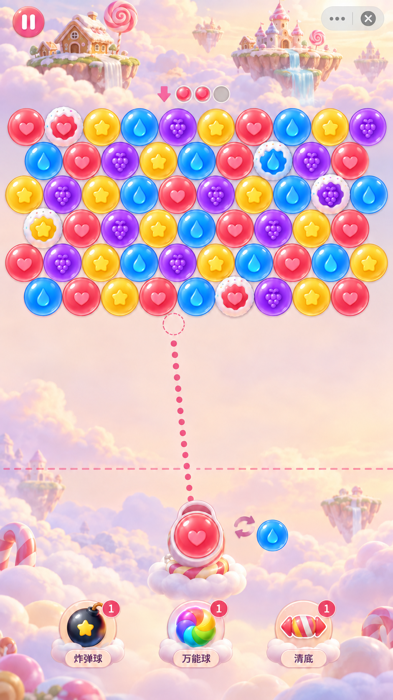
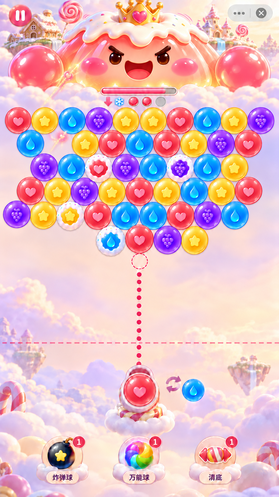

# 视觉与素材制作基线

## 1. 强制制作顺序

用户不会制作复杂角色动画，游戏以静态图片加代码动画完成。

每个模块/页面必须：明确功能和状态 → 生成完整效果图 → 用户确认 → 规划并生成拆分素材（一般透明背景）→ 检查素材与确认图一致 → 编码布局与交互 → 运行截图对照还原。

未获确认的页面不能因为主界面获批就直接实现。1:1 以设计基准尺寸和确认构图为依据，其他屏幕保证比例、可见性和安全边界。

## 通用弹窗与场景装饰（2026-09-12 用户确认原则）

- 三选一奖励、暂停、结算及同类弹窗统一使用泡泡龙内部的通用视觉主题，四区域复用基础面板、控件、字体层级和状态规范。奖励顶部胜利标题和 Boss 形象按场景替换。此复用范围是泡泡龙，不自动扩展到大厅或其他小游戏。
- 场景元素（含奖励顶部标题/Boss 组合）作为可拆卸的独立层叠加到通用弹窗上方或边缘；不烘焙进底板、不改变基础交互结构、不遮挡文字或点击区域。移除装饰后仍是完整弹窗。
- 各弹窗可按内容调整尺寸和布局，但沿用同一基础视觉，不为四区域分别制作四套奖励/暂停/结算主体。
- 用户随后明确喜欢奖励 v1：保留其奶油色圆润主体、粉色选中框和亮粉按钮作为通用视觉，仅顶部标题与 Boss 形象按场景区分。v2 的白紫主题不采用；v1 恢复为外观主依据。用户进一步指出 v3 主体仍有过多云朵：通用底板必须去掉肩部云团、波浪边和云朵轮廓，采用规整圆角矩形与水平胶囊提示底牌，保留 v1 暖色和粉色质感。当前候选见 [去云朵 v4](references/shared-reward-clean-base-draft-v4.png)，左侧主体、右侧云端组合；用户已确认按 v4 推进，开始拆分素材。
- 暂停、结算等仍需分别出效果图确认后拆素材和实现；通用原则获批不等于这些页面已经获批。

## 2. 屏幕与布局：用户明确的局部例外

- 750 × 1334，Cocos Fit Width；不因左右系统安全区缩窄通用布局。
- 全屏背景 cover 等比铺满，禁止拉伸。
- 2026-09-11 用户批准加高背景与场景分层：天空云海以 750 × 1800 设计比例提供上下适配余量，顶部浮岛、底部近景装饰独立定位。此为素材比例，不改变 750 × 1334 UI 基准。运行时仍根据实际尺寸 cover，不能仅凭加高图片宣称完成适配。
- 用户要求图片干净，降低颗粒、细碎云纹和闪点；中部低对比留白，渐变平滑。该要求适用于后续素材。
- 顶部场景/Boss 展示从屏幕顶边开始，含顶部安全区，横向铺满；暂停与微信胶囊叠在场景上，无整条导航栏。
- 信息可与胶囊同高，仅避让真实胶囊矩形及间距，不整条避让。这是用户对根 AGENTS 通用规则的明确例外，仅作用于本游戏。
- 暂停按钮位于左侧，与胶囊垂直对齐；胶囊由微信提供，不制作一个运行时假胶囊。
- 场景装饰可进入系统遮挡区，Boss 脸、关键信息、交互避开实际遮挡；最终皇冠需完整呈现。
- 底部保留安全区。短屏压缩装饰留白后等比缩小核心玩法，不裁切棋盘/操作区；长屏可自然留白。
- 普通/Boss 棋盘位置应稳定，不在登场时整块向下挤。

## 3. UI 信息结构

从上到下：沉浸式场景及悬浮暂停 → Boss 时的本体/血条 → 棋盘上沿图形计数 → 10/9 交错棋盘 → 危险线及空白瞄准空间 → 当前球/下一球/交换 → 三个道具按钮 → 底部安全留白。

- 不展示区域名称、区域序号、区域进度条。
- 普通：小向下箭头 + 累积糖珠槽，无“再有几次未消除则补行”文字牌。
- 槽位未消除时逐个填满，成功消除不清空；临界轻微脉冲，补行时清空。三个槽位仅效果示例，不锁定阈值。
- 计数槽使用一个空槽模板和一个独立填充珠，由运行时按实际阈值排列；不能生成固定三槽整图。
- Boss：向下箭头 + 专属技能图标 + 共用槽位，含义是到点补行并施法。
- 血条为 Boss 战斗信息，不是区域进度条。轨道框与填充条分层，填充宽度由实际血量驱动；效果图比例不是固定数值。无棋盘弱点、护甲核心或长连线。
- 三个道具共用同一空按钮底板，分别叠加炸弹球、万能球、清底图标；名称与库存数字使用运行时文本。库存角标底板独立，禁用、选中、按压和库存满态通过节点状态表现，不烘焙多套整按钮图片。
- 瞄准线必须真实直线/反弹折线，不能照搬生成图的弯曲或不合法落点。
- 暂停、奖励、复活、结算、换景、设置等完整页面尚未确认布局。

## 4. 云端软糖：已确认视觉方向

主题：清透果冻插画。关键词：轻盈、柔软、清透、糖果漂浮。

- 奶油/浅蜜桃天空、淡紫云团、糖果浮岛，棋盘背后低对比且简洁。
- 四色参考：珊瑚红、蜂蜜黄、湖水蓝、葡萄紫；分别有心形、星形、水滴、葡萄类内部纹样（最终一致性以参考图为准）。
- 泡泡中心颜色实、边缘透亮，统一高光；糖霜为乳白哑光边缘，露出内部颜色。
- 控件为圆润糖片/糖块，云团底座；文字数字保持清晰。字体授权和最终字体、精确色值未冻结。
- 普通与 Boss 共用球、发射器、道具和背景体系。
- 背景层缓动，球弹性缩放，消除碎屑位移/旋转/淡出，瞄准时不持续晃动棋盘。

### 普通阶段参考

### Boss 当前主参考

软糖布丁王：宽体、大脸、圆拳、奶油糖霜和皇冠。横向覆盖顶部大部分宽度，有压场感；身体纵向收紧，为棋盘保留空间。背景浮岛退后。

核心素材分层为默认表情身体、左拳、右拳和皇冠。身体承担呼吸/受击整体形变，拳头分别运动并保留同一场景光照，皇冠可轻微滞后摆动；不使用左右拳机械镜像。默认表情先保留在身体层，只有合成验证表明确需眨眼或换表情时再拆面部，避免无必要的拼缝。

主图获用户确认的是整体构图方向，不代表像素位置全部正确。已知待修正：皇冠顶端裁切、棋盘和底部控件相对旧版少量偏移、格位精度。不能把这些生成偏差当作新规则。

## 5. 其他区域：题材已确认，视觉待设计

| 区域 | 已有方向，尚非效果图批准 |
| --- | --- |
| 深海微光 | 蓝绿海水、珊瑚、水母环境、远景遗迹，气泡包裹珠核；最终 Boss 为章鱼，海草锚点、吸盘/抓取标记 |
| 桌面玩具 | 木桌、积木、纸板微缩布景，实体彩色玩具珠；积木机器人与轨道 |
| 魔幻世界 | 魔法森林/漂浮遗迹/符文，带纹样魔法球；悬浮石块组成的符文魔像 |

每个区域单独冻结材质、色板、字体层级、控件装饰、图标、Boss 与声音。共用位置、颜色含义、交互和碰撞规则，不默认全部继承软糖美术或大厅风格。

## 6. 拆分计划（已开始背景候选，其他待执行）

当前正式尺寸、九宫格、枢轴和资源路径见 [运行时素材规范](runtime-source/README.md)。候选素材未获用户确认前不标记为最终资产。

| 模块 | 图片素材计划 | 运行时承担 |
| --- | --- | --- |
| 场景 | 无 UI 的全屏背景；必要的近/远云层、浮岛分层 | cover、层移动、短屏适配 |
| 普通球 | 四色独立透明球，统一画布/枢轴/直径 | 格位、吸附、缩放、匹配、掉落 |
| 糖霜 | 独立覆盖层、少量碎屑 | 状态切换、碎裂淡出 |
| 发射 | 固定云团/糖杖底座、以底部转轴为枢轴的可旋转炮台、交换图标 | 当前球槽随炮台转动，球体视觉反向抵消角度以保持纹样正立；下一球独立；炮台角度、瞄准与轨迹共用发射方向 |
| 道具 | 三种独立图标、按钮底板、库存角标底 | 文本、数量、禁用态、触控反馈 |
| HUD | 暂停图标/底板、箭头、糖霜图标、槽位、血条框 | 动态填充、倒计数、数字、危险线 |
| 布丁王 | 身体、双拳、皇冠/糖霜装饰、必要表情分层 | 呼吸、拳头移动、受击形变、胜利退场 |
| 攻击反馈 | 单个能量心模板、四色各两块的分离糖屑源图 | 能量心池化后沿短曲线分批飞向 Boss；糖屑随机旋转、缩放、位移和淡出；闪光、聚合伤害与回收 |

分层数量在素材生产时审查，避免不必要切碎或动画拼缝；被遮挡的身体部分需补画，不能仅从整图裁切后留下空洞。图标和装饰通常透明背景，背景为完整图；文本不要烘焙进底板。

`art-source` 保存生成母版，不代表运行时纹理尺寸。运行时副本按 750 × 1334 设计坐标下的最大显示尺寸保留约 2 倍像素密度，小粒子可按最高显示尺寸保留约 3～4 倍像素密度；背景按批准的 750 × 1800 适配比例输出。透明素材先按有效 Alpha 边界加安全边距裁切，再做 Lanczos 降采样，禁止仅缩放整个 1254 × 1254 空画布。最终尺寸、用途和枢轴见 [运行时素材规范](runtime-source/README.md)。

四色普通球的运行时画布固定为 160 × 160 RGBA，球体是画布的严格内接圆：Alpha 有效边界必须等于 `(0, 0, 160, 160)`，上下左右四个切点正好顶住图片边界，四张图共享同一解析圆形 Alpha 和中心枢轴 `(0.5, 0.5)`。红心、黄星、蓝水滴和紫葡萄纹样保持正立；节点旋转、发射器反向抵消和掉落动画不得改变纹样的默认朝向定义。碰撞半径来自棋盘设计数据，不从图片非透明边界动态推导。

糖霜覆盖层与普通球共用相同的 160 × 160 画布和中心枢轴；中心孔必须为真实透明，运行时直接叠在任意颜色球上，不为四色分别烘焙糖霜球。糖霜碎屑源图包含七块彼此分离的碎片，切片后以中心为各自枢轴，随机运动只由代码控制。

发射器运行时分为固定底座、可旋转炮台、当前球、下一球和交换图标。固定底座画布为 384 × 256，建议锚点约 `(0.5, 0.125)` 对准可见云团底部；炮台画布为 192 × 320，旋转锚点约 `(0.5, 0.10)` 对准底部珍珠机械轴，而不是图片底边。当前球作为炮台旋转节点的子节点放在圆环后方，球的视觉子节点使用相反角度保持纹样正立。交换图标为 96 × 96、中心枢轴。固定底座不得跟随瞄准角旋转。

宽体布丁王运行时分为身体、左拳、右拳和皇冠四层，纹理分别为 1024 × 512、384 × 320、384 × 320、320 × 256 RGBA。身体锚点约 `(0.5, 0.06)`，呼吸和受击形变以底部支撑线为基准；左右拳的身体连接端分别约为 `(0.90, 0.52)` 与 `(0.10, 0.52)`，用于独立蓄力、出拳和回弹；皇冠锚点约 `(0.5, 0.08)`，轻微滞后跟随身体。左右拳各自保留确认场景中的光照，不能用单张素材镜像代替。默认脸保留在身体层，当前不增加眼睛和嘴部拼缝。

左右浮岛均为 512 × 512 RGBA 独立远景层，节点建议分别控制在约 300 × 300 设计单位内，只做幅度很小、周期较长且略有相位差的上下缓动；不能进入 Boss 或棋盘节点，也不能因屏幕变矮向下侵占棋盘。左岛沿用无瀑布的姜饼屋与棒棒糖造型，右岛保留城堡和两段瀑布，不相互镜像。底部前景为 750 × 320 RGBA，使用底部中心锚点横向贴满屏幕，随底部安全区定位；中央云团刻意保持低矮，发射器和三道具节点位于前景上层。加高天空底图不含这三层，因此独立叠加不会产生重影。

计数提示由 96 × 96 空槽模板与 64 × 64 填充珠组成，两者中心对齐，运行时按实际阈值动态排列。空槽中央的中性灰内凹面是素材本体并保持不透明；只有外圈以外透明。临界脉冲作用于填充珠或整组节点，不烘焙额外状态图。

Boss 血条轨道与填充分层。轨道使用 192 × 96 紧凑九宫格贴图，左右切片边界各 48 像素；填充使用 128 × 64 紧凑九宫格贴图，左右切片边界各 32 像素。两张贴图都使用数学对称的胶囊几何：左右端为同半径半圆，中间为同高矩形，切片线穿过端部圆心；轨道外框、粉色描边和灰槽分别使用同心胶囊蒙版，不能从不同横向位置拼接。两层保持固定高度，只拉伸中段；填充叠在轨道灰槽上方，并通过节点宽度与裁切遮罩显示血量。零血量隐藏填充，低血量裁切圆头，禁止用普通横向缩放压扁端帽。效果图中的长度和血量比例不作为数值依据。

炸弹球、万能球和清底三个道具图标共用 192 × 192 RGBA 画布与中心枢轴。炸弹完整保留顶部引线，万能球的可见圆径为 176 像素，清底糖果保持横向包装比例并在上下保留透明空间；不能为了占满圆槽把清底图标纵向拉伸。三个图标叠在共用按钮底板的圆形槽内，文字区、库存角标、禁用蒙层、选中光效和按压缩放都由独立运行时节点承担。

攻击反馈贴图不烘焙长光束、曲线路径或整段逐帧动画。一次消除可从若干代表位置发出少量错峰能量心，视觉实例数与实际伤害值不绑定；到达 Boss 后统一触发结算表现。攻击糖屑按红、黄、蓝、紫各两张独立紧凑 PNG 复用，优先使用命中颜色；糖霜碎屑使用七张独立 PNG。每张切片使用画布中心枢轴，随机旋转、缩放、初速度、位移和淡出由对象池实例承担。退出或 `dispose()` 时必须停止补间并回收全部实例。

Auto Atlas 只用于同 Bundle 同模块一起用的小 SpriteFrame，不把大背景和 Boss 机械混合合图。

不生成音频。需要音频时按项目 audio-prompt 技能提供手工外部制作提示；音乐/音效具体方向目前未确认。

## 7. 当前视觉依据

当前保留的效果图只用于确认构图与场景风格，运行时实际使用 `assets/game-assets/bubble-shooter` 中的处理后资源；生成提示词、批次记录和逐次评审图已清理。

## 复活与结算基线（2026-09-12）

2026-09-12 复活/结算修订：用户指出 v1 太像云端；[v2](references/shared-revive-result-draft-v2.png)改为中性浅白、薄倒角、弱高光与粉色按钮，用户已明确确认“就定这个”，作为复活/结算正式制作基线。已确认奖励 v4 暂不变更。

## 弹窗场景叠加补充（2026-09-12 用户明确要求）

复活、结算、暂停等弹窗与道具选择弹窗一致，最终呈现为“通用基础 + 当前区域专属样式/素材”。每个区域的标题装饰、主题图标或边角素材独立叠加，保持主体功能和控件一致。复活/结算 v2 与云端 Boss 叠顶 v2 已确认并接入；奖励 v4 继续作为通用主体。

用户修正云端复活/结算组合：不采用零散云团/糖果边角装饰作为主要场景特征，改为类似奖励页的 Boss 叠顶构图。当前 [Boss 叠顶 v2](references/cloud-revive-result-boss-draft-v2.png)已获用户确认（“符合”），构图和大小比例作为云端复活/结算制作基线；通用主体保持已确认浅白 v2，Boss 本体在后、拳头可在前，独立分层。

### 2026-09-13 装填珠心旋转与顶部云层接入

用户最终指定装填珠子的中心为炮台转轴：PIVOT=(0,-404)，MUZZLE_OFFSET=0；CurrentBall 局部位置为 0，上部炮台图片局部 y=-46，固定连接杆与底座位置不变。此前圆环底部转轴方案被本决定替代。

顶部云层 / 放大 Boss 效果图 v2 已确认并接入。正式素材 `assets/game-assets/bubble-shooter/visual/regions/cloud/backgrounds/cloud-transition.png` 为 1024×180 RGBA，场景静态引用；云层遮住角色下缘，Boss 血条独立布局。奖励界面隐藏这些战斗装饰，继续游戏时恢复。棋盘 TOP=410 和现有底部布局不变。
